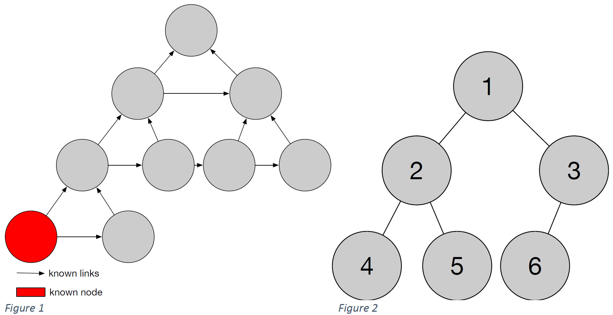

<h2>Software Engineering - Assignment 3</h2>
<h3>Visitor Pattern Implementation</h3>

<h2>Scenario</h2>
 
Consider the following data structure: The data structure we consider, is organised as a binary tree, each node has a value. The tree is structured as following: Each node dose only knows its parent node and its right neighbour. Public known is the most left (and most bottom) node, the root node is not known (see figure 1). Further, the data structure is filled from LEFT to RIGHT and from TOP to BOTTOM (see figure 2).

Beside the data structure itself, different operations have to be performed on the data structure: 

<ol>
	<li>Output the value of the root node</li>
	<li>Output the sum of the values of all nodes</li>
	<li>Output the sum of the values of all leafs</li>
</ol>

To realise the operations, the Visitor Pattern has to be used.
 

<h2>Tasks</h2>
	<ul>
		<li>Starting with an empty data structure, add the following value set [5,7,8,15,20,21,13,18,11,42].</li>
		<li>Implement the data structure and the Visitor Pattern in Java.</li>
		<li>Implement an additional class with an executable main method. This class has to initiate a tree and it has to perform the 3 given operations on the tree.</li>
		<li>Hand in the class implementation (.java)</li>
	</ul>
